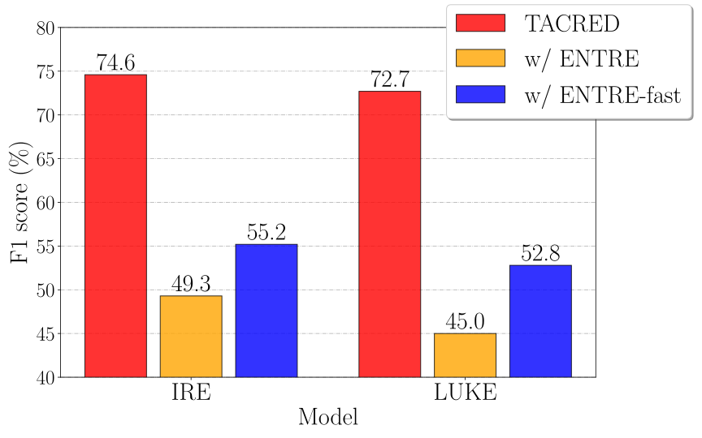

# How Fragile is Relation Extraction under Entity Replacements?
[](https://arxiv.org/abs/2305.13551)

## Overview

This repo includes the source code and data for our work *How Fragile is Relation Extraction under Entity Replacements?*. In this work, we operate the random and type-constrained entity replacements over the RE instances in TACRED and evaluate the state-of-the-art RE models under the entity replacements. We observe the 30\% - 50\% F1 score drops on the state-of-the-art RE models under entity replacements.

Relation extraction models are fragile to our entity replacements (ENTRE)|  
:-------------------------:|
|

## A New Relation Extraction Dataset: ENTRED

[2023/05/29] ENTRED is a challenging relation extraction dataset that we build by applying the type-constrained entity replacements on TACRED. You need not run the code from scratch to build the dataset ENTRED from beginning. We have provided the built ENTRED at `new_test.json`. ENTRED is in the same data format as the existing relation extraction datasets TACRED, TACREV, and Re-TACRED. We introduce all the .json files as following.

1. `test_entred.json`: The proposed benchmark: ENTRED.
2. `test.json`: The test set of TACRED.
3. `re_test.json`: The test set of Re-TACRED.
4. `rev_test.json`: The test set of TACREV.

## Evaluate LUKE on TACRED and ENTRED 

### Evaluate LUKE on TACRED:
```
python inference.py --input_file test.json --output_file luke_test.output --model luke
```

### Evaluate LUKE on ENTRED:
```
python inference.py --input_file test_entred.json --output_file luke_test_entred.output --model luke
```

### Evaluation of LUKE under entity replacements
```
python entre.py --input_file test.json --output_file output_luke_200.json --model luke --repeat_time 200
```

## Collecting Person and Organization Names from Wikipedia (Optional)
>get_wiki.ipynb

This step can be skipped because we have stored the outputs to `wiki_organization.output` and `wiki_person.output`.

## Data Analysis of Existing Relation Extraction Datasets (Optional)
>entre.ipynb

This step can be skipped because we have stored the outputs to `final_id_resample_ls.output`.


